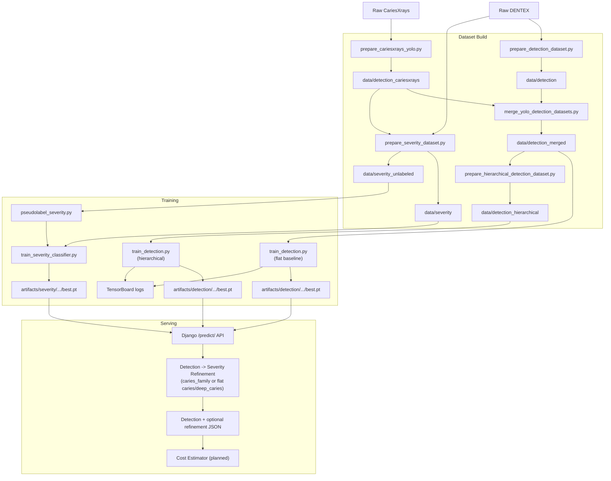
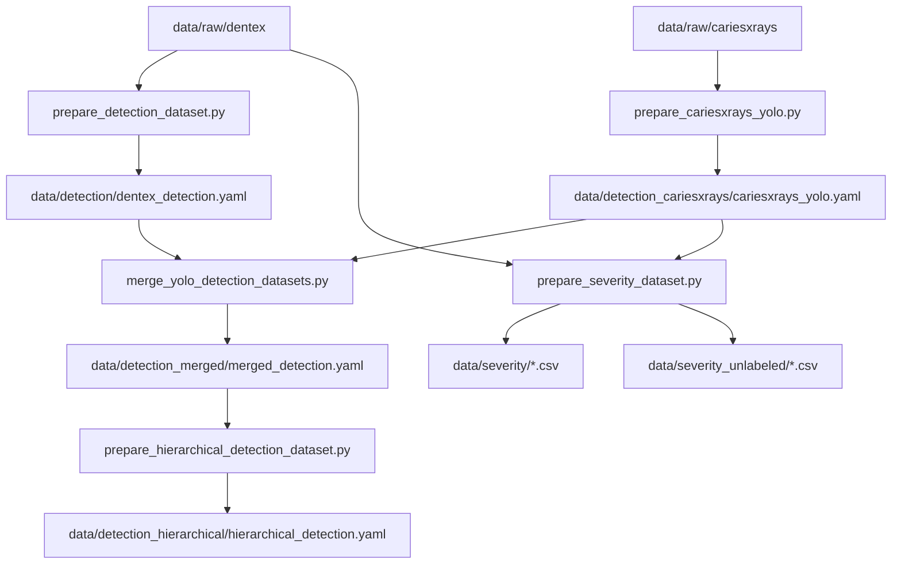
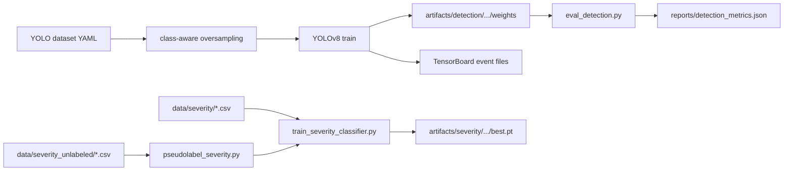

# DENTAL AI Project Architecture

## 1) 목표

본 프로젝트는 파노라마 치과 X-ray에서 질환 의심 부위를 탐지하고, 그 결과를 웹 API와 향후 비용 추정 로직으로 연결하는 detection-first 파이프라인이다.

현재 구현 범위는 다음과 같다.

- 공개 X-ray 데이터셋 수집 및 로컬 적재
- YOLO detection 학습용 데이터셋 생성
- hierarchical detection remap 및 lesion crop 분류 데이터셋 생성
- YOLOv8 기반 질환 탐지 학습 및 평가
- `caries` vs `deep_caries` severity classifier 학습 및 pseudo-label 실험
- Django 기반 2-stage 추론 API 제공
- TensorBoard를 통한 학습 모니터링


## 2) 문제 정의

현재 프로젝트는 두 가지 문제 정의를 함께 지원한다.

### 2.0 Flat baseline

- 입력: 파노라마 치과 X-ray 이미지
- 출력: `bbox`, `class`, `confidence`
- 클래스(4개):
  - `caries`
  - `deep_caries`
  - `periapical_lesion`
  - `impacted_tooth`

Detection을 채택한 이유:

- 단순 분류보다 위치 근거를 함께 제공할 수 있음
- 분할보다 라벨링 비용과 구현 복잡도가 낮음
- 웹서비스 응답 형태와 직접 연결하기 쉬움


### 2.1 Hierarchical 경로

`CariesXrays`는 현재 `caries` 계열 bbox만 제공하고 `deep_caries`를 따로 나누지 않기 때문에,
flat 4-class detection만으로 severity를 직접 학습시키면 coarse label noise가 커질 수 있다.

이를 보완하기 위해 프로젝트는 다음 hierarchical 경로도 지원한다.

- 1단계 detection 클래스:
  - `caries_family`
  - `periapical_lesion`
  - `impacted_tooth`
- 2단계 severity classification:
  - `caries`
  - `deep_caries`
- 선택적 semi-supervised:
  - CariesXrays lesion crop에 pseudo-label 생성 후 severity classifier 재학습

즉, localization은 detection이 담당하고, `caries` vs `deep_caries` 세분화는 ROI crop classifier가 뒤에서 수행한다.

현재 코드 기준으로는 flat baseline을 유지하면서도, 데이터 제약이 큰 `deep_caries`는 hierarchical 경로를 기본 실험 축으로 삼도록 구조를 확장한 상태다.


## 3) 데이터 소스와 라벨 매핑

### 3.1 DENTEX

- 원천: Hugging Face `LUNA0206/DENTEX`
- 로컬 원본 경로: `data/raw/dentex/DENTEX`
- 전처리 스크립트: `scripts/prepare_detection_dataset.py`

DENTEX는 현재 4개 detection 클래스로 매핑된다.

- `caries`
- `deep_caries`
- `periapical_lesion`
- `impacted_tooth`

또한 hierarchical 경로에서는 DENTEX의 `caries` / `deep_caries` annotation이 lesion crop 분류 데이터의 supervised source로도 사용된다.

### 3.2 CariesXrays

- 원천: AAAI 2024 CariesXrays 공개 릴리스
- 로컬 원본 경로: `data/raw/cariesxrays`
- 전처리 스크립트: `scripts/prepare_cariesxrays_yolo.py`

CariesXrays는 Pascal VOC XML 기반 bbox 데이터셋이며, 이 프로젝트에서는 원천 라벨 `Decay`만 사용한다.

- VOC label `Decay` -> project class `caries` (`class_id=0`)
- 나머지 3개 클래스는 CariesXrays에서 추가되지 않음

즉 CariesXrays는 이 프로젝트에서 `caries` 클래스 증강용 단일-class detection 데이터로 쓰인다.

hierarchical 경로에서는 같은 CariesXrays bbox를 다음 두 용도로 쓴다.

- `caries_family` detection 학습용 lesion bbox
- severity pseudo-label 생성을 위한 unlabeled lesion crop source


### 3.3 Hierarchical 라벨 재구성

hierarchical detection에서는 기존 4-class 라벨을 아래처럼 다시 묶는다.

- `caries` -> `caries_family`
- `deep_caries` -> `caries_family`
- `periapical_lesion` -> `periapical_lesion`
- `impacted_tooth` -> `impacted_tooth`

즉, detection 단계에서는 충치 계열 병변을 하나의 coarse class로 잡고, 세부 depth 판단은 별도 classifier가 맡는다.


## 4) 현재 로컬 데이터셋 구성

### 4.1 DENTEX YOLO 변환 결과

- 경로: `data/detection`
- YAML: `data/detection/dentex_detection.yaml`
- split:
  - train: 199
  - val: 28
  - test: 58

### 4.2 CariesXrays YOLO 변환 결과

- 경로: `data/detection_cariesxrays`
- YAML: `data/detection_cariesxrays/cariesxrays_yolo.yaml`
- split:
  - train: 4176
  - val: 596
  - test: 1194

### 4.3 병합 데이터셋

- 경로: `data/detection_merged`
- YAML: `data/detection_merged/merged_detection.yaml`
- split:
  - train: 4375
  - val: 624
  - test: 1252

병합 데이터셋은 DENTEX의 4-class 구조를 유지하면서 CariesXrays의 `caries` bbox를 추가한 형태다.

### 4.4 Hierarchical detection 데이터셋

- 경로: `data/detection_hierarchical`
- YAML: `data/detection_hierarchical/hierarchical_detection.yaml`
- 클래스(3개):
  - `caries_family`
  - `periapical_lesion`
  - `impacted_tooth`

이 데이터셋은 `data/detection_merged`의 라벨을 재매핑한 결과물이다.

### 4.5 Severity crop 데이터셋

- 경로: `data/severity`
- split CSV:
  - `train.csv`
  - `val.csv`
  - `test.csv`
- 클래스(2개):
  - `caries`
  - `deep_caries`

raw supervised source는 `validation_triple.json`의 lesion annotation이며, 현재 원천 annotation 수는 다음과 같다.

- `caries`: 101
- `deep_caries`: 32

### 4.6 Severity unlabeled crop 데이터셋

- 경로: `data/severity_unlabeled`
- split CSV:
  - `train.csv`
  - `val.csv`
  - `test.csv`

이 데이터셋은 CariesXrays bbox를 crop으로 잘라낸 unlabeled lesion pool이며, pseudo-label 실험에 사용된다.


## 5) 시스템 구성

프로젝트는 5개 레이어로 나뉜다.

1. Raw data layer
   - DENTEX, CariesXrays 원본 저장
2. Dataset build layer
   - YOLO 포맷 변환
   - 다중 데이터셋 병합
   - hierarchical detection 라벨 재구성
   - lesion crop supervised / unlabeled dataset 생성
3. Training layer
   - YOLOv8 학습
   - detection class imbalance 완화
   - severity classifier 학습
   - pseudo-label 생성 및 재학습
   - TensorBoard 기록
   - 필요 시 외부 GPU 환경에서 학습 후 weight 반입
4. Serving layer
   - Django `/predict/` 추론 API
   - detection -> severity refinement
5. Extension layer
   - detection 결과 기반 치료비 추정

### 5.1 전체 아키텍처




## 6) 프로젝트 구조

```text
dental/
  data/
    raw/
      dentex/                         # DENTEX 원본
      cariesxrays/                   # CariesXrays 원본(XML + images)
    detection/                       # DENTEX -> YOLO 변환 결과
    detection_cariesxrays/           # CariesXrays -> YOLO 변환 결과
    detection_merged/                # DENTEX + CariesXrays 병합 결과
    detection_hierarchical/          # 3-class hierarchical detection 데이터셋
    severity/                        # labeled severity crop 분류 데이터셋
    severity_unlabeled/              # CariesXrays lesion crop (pseudo-label 대상)
    processed/                       # 보조 CSV/통계 산출물
  scripts/
    download_dataset.py              # DENTEX 다운로드
    prepare_detection_dataset.py     # DENTEX -> YOLO
    prepare_cariesxrays_yolo.py      # CariesXrays VOC -> YOLO
    merge_yolo_detection_datasets.py # YOLO 데이터셋 병합
    prepare_hierarchical_detection_dataset.py # 4-class YOLO -> hierarchical YOLO
    prepare_severity_dataset.py      # severity crop dataset + unlabeled crop export
    train_severity_classifier.py     # caries vs deep_caries 분류기 학습
    pseudolabel_severity.py          # CariesXrays crop pseudo-label 생성
    train_detection.py               # YOLO 학습 + TensorBoard
    eval_detection.py                # detection 평가
    log_results_csv_to_tensorboard.py
    watch_results_csv_tensorboard.py
    install_torch.py
  django_app/
    classifier/
      inference.py
      views.py
    config/
      settings.py
      urls.py
  src/
    severity/                        # severity classifier dataset/model/inference
  artifacts/
    detection/                       # 학습 결과 및 weights
    severity/                        # severity classifier checkpoints
  reports/
    detection_metrics.json
    process_logs/
  ARCHITECTURE.md
  README.md
```


## 7) 데이터 처리 프로세스

### 7.1 DENTEX 전처리

`scripts/prepare_detection_dataset.py`가 다음 작업을 수행한다.

1. `validation_triple.json`에서 annotation을 읽음
2. validation category를 프로젝트 4개 클래스에 매핑
3. `test_data/disease/label/*.json`도 읽어 bbox를 추출
4. bbox를 YOLO 형식 `class cx cy w h`로 변환
5. `train/val/test`로 분할
6. `data/detection/dentex_detection.yaml` 생성

### 7.2 CariesXrays 전처리

`scripts/prepare_cariesxrays_yolo.py`가 다음 작업을 수행한다.

1. `Annotations/*.xml`와 `JPEGImages/*`를 탐색
2. Pascal VOC `bndbox`를 읽음
3. `Decay` 라벨만 유지
4. `Decay -> caries (class_id=0)`로 매핑
5. 파일명 충돌 방지를 위해 `cx_` prefix를 적용 가능
6. `train/val/test`로 분할
7. `data/detection_cariesxrays/cariesxrays_yolo.yaml` 생성

### 7.3 병합

`scripts/merge_yolo_detection_datasets.py`는 두 YOLO 데이터셋이 같은 클래스 순서를 가진다는 전제 하에 동작한다.

병합 규칙:

- base: `data/detection`
- extra: `data/detection_cariesxrays`
- out: `data/detection_merged`

출력:

- `images/{train,val,test}`
- `labels/{train,val,test}`
- `merged_detection.yaml`

### 7.4 Hierarchical detection 재구성

`scripts/prepare_hierarchical_detection_dataset.py`는 `data/detection_merged` 또는 다른 4-class YOLO 데이터셋을 입력으로 받아 다음 작업을 수행한다.

1. 기존 YOLO YAML에서 dataset root와 class names를 읽음
2. 각 label txt를 순회
3. `caries`, `deep_caries`를 `caries_family`로 재매핑
4. 이미지와 재매핑된 label을 `data/detection_hierarchical`로 복사 또는 링크
5. `hierarchical_detection.yaml` 생성

### 7.5 Severity crop 데이터셋 생성

`scripts/prepare_severity_dataset.py`는 다음 두 가지 산출물을 만든다.

1. DENTEX `validation_triple.json`에서 `caries` / `deep_caries` bbox를 읽음
2. bbox 주변에 margin을 두고 lesion crop을 저장
3. `train/val/test` split CSV를 `data/severity`에 생성
4. 선택적으로 CariesXrays YOLO bbox를 crop으로 잘라 `data/severity_unlabeled`를 생성

즉, supervised severity dataset과 pseudo-label 후보 pool을 같은 스크립트에서 준비한다.

### 7.6 데이터 파이프라인 도식




## 8) 학습 프로세스

### 8.1 학습 입력

기본 detection 학습 엔트리포인트는 `scripts/train_detection.py`다.

실제 학습 실행 위치는 두 가지를 모두 허용한다.

- 로컬 Windows 환경에서 직접 학습
- 외부 GPU 환경에서 학습 후 생성된 weight를 로컬 프로젝트로 다운로드

현재 프로젝트에서는 로컬 GPU 제약이 크기 때문에, 장시간 학습이나 더 큰 설정의 실험은 외부 GPU 환경에서 수행하고 결과물인 `best.pt`, `last.pt`를 내려받아 사용하는 흐름을 전제로 한다.

주요 입력:

- `--data`: YOLO dataset YAML
- `--model`: 기본값 `yolov8n.pt`
- `--epochs`
- `--imgsz`
- `--batch`
- `--device`
- `--amp/--no-amp`
- `--tensorboard/--no-tensorboard`
- `--deep-caries-balance/--no-deep-caries-balance`
- `--oversample-class`

### 8.2 불균형 완화

`train_detection.py`는 특정 클래스가 포함된 train 이미지를 반복 삽입하는 방식으로 oversampling을 수행할 수 있다.

동작 방식:

- train split의 라벨 파일을 순회
- `--oversample-class`에 해당하는 이미지 탐지
- 클래스 빈도 기반 repeat factor 계산
- manifest txt와 balanced YAML을 `artifacts/detection/training_assets`에 생성

즉, 원본 데이터셋을 직접 수정하지 않고 학습 입력 manifest만 바꿔 imbalance를 완화한다.

flat baseline에서는 기본값으로 `deep_caries`를 oversample하고, hierarchical detection에서는 보통 `--no-deep-caries-balance` 또는 다른 coarse class 지정이 적절하다.

### 8.3 Severity classifier 학습

severity classifier 학습 엔트리포인트는 `scripts/train_severity_classifier.py`다.

입력:

- `--train-csv`: 기본값 `data/severity/train.csv`
- `--val-csv`: 기본값 `data/severity/val.csv`
- `--pseudo-csv`: 선택적 pseudo-label CSV
- `--model-name`: 기본값 `efficientnet_b0`
- `--img-size`
- `--batch-size`
- `--epochs`
- `--lr`
- `--pseudo-weight-scale`

학습 방식:

- lesion crop 분류 문제로 `caries` vs `deep_caries`를 학습
- labeled sample은 weight `1.0`
- pseudo-labeled sample은 `confidence * pseudo_weight_scale`로 가중
- checkpoint는 `artifacts/severity/<run>/best.pt` 등에 저장

### 8.4 Pseudo-labeling

`scripts/pseudolabel_severity.py`는 unlabeled lesion crop에 teacher classifier를 적용해 high-confidence sample만 선별한다.

흐름:

1. `data/severity_unlabeled/*.csv`를 읽음
2. 현재 severity checkpoint로 각 crop의 class probability 계산
3. threshold 이상 샘플만 pseudo-label CSV로 저장
4. `train_severity_classifier.py --pseudo-csv ...`로 재학습

즉 semi-supervised는 detection이 아니라 severity classifier 단계에서만 제한적으로 적용한다.

### 8.5 TensorBoard 기록

Windows 비ASCII 경로 문제를 피하기 위해 Ultralytics 기본 TensorBoard 대신 `torch.utils.tensorboard.SummaryWriter`를 직접 연결한다.

기록 위치:

- `%TEMP%/dental_yolo_tb/<run_name>`

기록 정책:

- `train/box_loss`, `train/cls_loss`, `train/dfl_loss`: batch 단위
- `lr/*`: epoch 단위
- `metrics/mAP50_B`, `metrics/mAP50-95_B`, `metrics/precision_B`, `metrics/recall_B`: epoch 단위
- `val/*`: epoch 단위

현재 TensorBoard 연결은 detection training에 적용되어 있으며, severity classifier는 별도 JSON/console metric을 기록한다.

### 8.6 학습 파이프라인 도식



weight 반입 규칙:

- 외부 GPU 학습이 끝나면 detection / severity checkpoint를 로컬로 다운로드
- detection checkpoint는 `artifacts/detection/<run>/weights` 아래에 둘 수 있음
- severity checkpoint는 `artifacts/severity/<run>` 아래에 둘 수 있음
- 서빙 시에는 선택한 checkpoint를 `artifacts/detection/serve/best.pt`, `artifacts/severity/serve/best.pt`로 복사하거나 환경변수로 지정
- 즉, 학습 실행 위치와 weight 소비 위치를 분리할 수 있다


## 9) 추론 프로세스

Django 서비스는 학습된 detection weight를 로드해 `/predict/` 요청을 처리한다.

이 weight는 반드시 로컬에서 직접 학습한 결과일 필요는 없으며, 외부 GPU 환경에서 학습 후 다운로드한 `best.pt`를 로컬에 배치해 사용해도 된다.

기본 입출력 흐름:

1. 사용자가 X-ray 업로드
2. Django view가 추론 래퍼 호출
3. YOLO 모델이 bbox/class/confidence 생성
4. 충치 계열 detection이면 bbox crop을 severity classifier에 전달
5. JSON 응답 반환

현재 코드 기준 refinement 동작:

1. hierarchical detector를 쓰는 경우 YOLO가 `caries_family` bbox를 검출
2. flat detector를 쓰는 경우에도 YOLO가 `caries` 또는 `deep_caries`를 검출하면 same ROI refinement 경로를 탈 수 있다
3. bbox crop을 severity classifier에 전달
4. classifier가 `caries` 또는 `deep_caries`로 세분화 또는 재판정한다
5. `/predict/`는 detector 원본 class와 refinement 결과를 함께 반환할 수 있다

서빙 weight 규칙:

- detection weight 기본 경로: `artifacts/detection/serve/best.pt`
- severity weight 기본 경로: `artifacts/severity/serve/best.pt`
- 환경변수:
  - `DENTAL_YOLO_WEIGHTS`
  - `DENTAL_SEVERITY_WEIGHTS`
  - `DENTAL_SEVERITY_CONF`

fallback 동작:

- severity weight가 없으면 detection 결과를 그대로 반환
- hierarchical detector에서는 severity confidence가 낮으면 `caries_family`를 유지할 수 있음
- flat detector에서는 severity confidence가 낮으면 detector의 원래 `caries` / `deep_caries` 예측을 유지할 수 있음
- 즉, classifier refinement는 optional enhancement다

### 9.1 추론 도식

여기서 detection 모델은 단일 블랙박스가 아니라, 내부적으로 `YOLOv8` 서브모듈로 구성된다.

- Backbone: `Conv -> C2f -> SPPF`로 입력 영상의 다중 해상도 feature를 추출
- Neck: upsample / concat / C2f로 `P3`, `P4`, `P5` feature pyramid를 결합
- Head: anchor-free split detection head가 각 scale에서 bbox / class score를 예측

```mermaid
graph LR
    client["Client"] --> api["POST /predict/"]
    api --> infer["classifier/inference.py"]

    infer --> xray["input X-ray image"]

    subgraph yolo["YOLOv8 Detector"]
        direction LR
        weights["YOLO model weights (.pt)"]

        subgraph backbone["Backbone"]
            direction TB
            bb1["Conv stem"]
            bb2["C2f stages"]
            bb3["SPPF"]
        end

        subgraph neck["Neck"]
            direction TB
            nk1["Upsample"]
            nk2["Concat"]
            nk3["C2f feature fusion"]
            nk4["P3 / P4 / P5 feature maps"]
        end

        subgraph head["Head"]
            direction TB
            hd1["Anchor-free split head"]
            hd2["Detect(P3, P4, P5)"]
            hd3["bbox + class + confidence"]
        end
    end

    xray --> backbone
    weights --> backbone
    backbone --> neck
    neck --> head
    head --> det["detections<br/>(caries_family or flat caries/deep_caries)"]

    infer --> sev["Severity classifier weights"]
    det --> crop["lesion crop<br/>(caries_family or flat caries/deep_caries)"]
    crop --> sev
    sev --> refine["caries / deep_caries refinement<br/>or flat prediction override"]
    refine --> json["prediction JSON"]
```




## 10) 운영 제약과 현재 학습 환경

현재 로컬 학습 환경:

- Windows
- NVIDIA GeForce MX450
- VRAM 2GB

따라서 현재 운영 상정은 다음과 같다.

- 데이터 전처리, 경량 테스트, 추론 API 실행은 로컬에서 수행
- 본 학습 또는 장시간 실험은 외부 GPU 환경에서 수행 가능
- 외부 GPU에서 생성한 weight를 로컬로 다운로드해 평가 및 서빙에 사용

실무상 반영된 제약:

- `workers=0` 권장
- 낮은 VRAM 환경에서는 `--batch 1 --imgsz 320 --no-amp` 조합이 안전
- `WinError 1455`가 발생하면 Windows page file 확장이 필요
- TensorBoard는 브라우저 탭 상태에 따라 새로고침이 필요할 수 있으나, 이벤트 파일 기록 자체는 별도로 계속 진행된다


## 11) 대표 실행 시나리오

### 11.1 DENTEX만 학습

1. `python scripts/download_dataset.py`
2. `python scripts/prepare_detection_dataset.py`
3. `python scripts/train_detection.py --data data/detection/dentex_detection.yaml`

### 11.2 CariesXrays 포함 학습

1. CariesXrays 원본 다운로드 및 압축 해제
2. `python scripts/prepare_cariesxrays_yolo.py --raw data/raw/cariesxrays --out data/detection_cariesxrays --stem-prefix cx_`
3. `python scripts/merge_yolo_detection_datasets.py --base data/detection --extra data/detection_cariesxrays --out data/detection_merged`
4. `python scripts/train_detection.py --data data/detection_merged/merged_detection.yaml`

### 11.3 Hierarchical detection + severity classifier

1. `python scripts/prepare_hierarchical_detection_dataset.py --data data/detection_merged/merged_detection.yaml`
2. `python scripts/train_detection.py --data data/detection_hierarchical/hierarchical_detection.yaml --no-deep-caries-balance`
3. `python scripts/prepare_severity_dataset.py`
4. `python scripts/train_severity_classifier.py`

선택적 semi-supervised 단계:

5. `python scripts/pseudolabel_severity.py --weights artifacts/severity/efficientnet_b0/best.pt --output-csv artifacts/severity/pseudo/train.csv`
6. `python scripts/train_severity_classifier.py --pseudo-csv artifacts/severity/pseudo/train.csv --output-dir artifacts/severity/efficientnet_b0_pseudo`

### 11.4 TensorBoard 모니터링

1. `python scripts/train_detection.py --name yolov8n_live`
2. `tensorboard --logdir "%TEMP%\\dental_yolo_tb" --reload_interval 2`

### 11.5 외부 GPU 학습 후 로컬 서빙

1. 로컬에서 데이터셋 전처리 및 YAML 생성
2. 동일한 프로젝트 또는 산출물 묶음을 외부 GPU 환경으로 전달
3. 외부 GPU에서 `python scripts/train_detection.py ...` 실행
4. 필요하면 외부 GPU에서 `python scripts/train_severity_classifier.py ...`도 실행
5. 학습 완료 후 detection / severity `best.pt`를 각각 로컬 `artifacts/detection/...` 및 `artifacts/severity/...`로 다운로드
6. 선택한 checkpoint를 `artifacts/detection/serve/best.pt`, `artifacts/severity/serve/best.pt`로 배치하거나 환경변수로 지정
7. 다운로드한 weight를 Django 추론 API와 평가 스크립트에서 사용


## 12) 향후 확장

현재 detection 파이프라인 이후 확장 예정 항목은 다음과 같다.

- 치아 번호 또는 해부학적 위치 정보 결합
- detection 결과 기반 치료행위 매핑
- 비용 범위 추정
- explanation layer 추가
- active learning 기반 severity relabel loop

주의:

- 본 시스템은 의료 진단 확정 도구가 아니라 보조 의사결정 도구로 다뤄야 한다.
