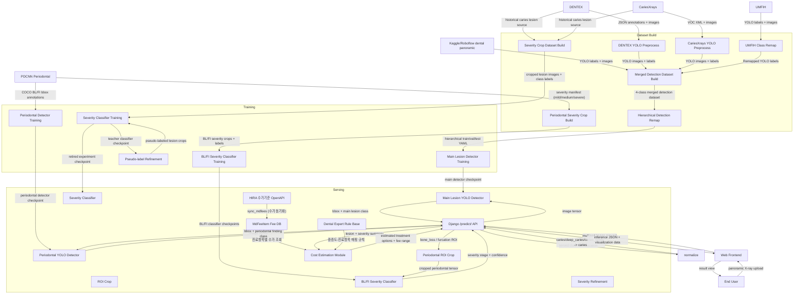

# Dental AI Project Architecture

## 1. 프로젝트 개요

본 프로젝트는 치과 X-ray 이미지에서 병변을 자동 검출하고, 위치·유형·치주 중증도 정보를 함께 제시하는
진단 보조 시스템을 구축하는 것을 목표로 한다.

이 프로젝트의 문제의식에는 국내 치과 진료 현장에서 제기되는 과잉진료 우려와 진료비 설명 부족 문제가 포함된다.
한국소비자원(2025)은 치과 관련 피해구제 신청에서 진료비 관련 분쟁이 증가하고 있으며, 치료비용계획서 제공
활성화가 필요하다고 지적했다. 또한 파노라마 X-ray 판독은 병변이 작거나 겹쳐 보이는 경우 해석 난도가 높아,
환자 입장에서는 진단의 적절성을 스스로 검증하기 어렵다. 이러한 맥락에서 설명 가능한 보조 판독 도구에 대한
수요가 존재한다.

본 프로젝트는 병변 위치와 유형을 일관된 기준으로 제시함으로써 판독의 재현성을 높이고 설명 가능성을 보완하는
진단 보조 시스템을 지향한다. 궁극적으로는 임상의의 판단을 지원하고, 환자와 의료진 사이의 커뮤니케이션 근거를
강화하는 것이 목적이다. 장기적으로는 X-ray 상의
병변 분류 결과를 바탕으로 치료 옵션별 적정 진료비 범위를 제시하는 보조 모듈까지 확장하는 것을 목표로 하며,
이 과정에서는 치과의사 자문을 반영해 임상적 타당성과 현실성을 확보한다.

현재 서비스 기준 흐름은 다음과 같다.

- 주요 병변 detection: `caries_family`, `periapical_lesion`, `impacted_tooth`, `retained_root`
- 치주 전용 detection: `bone_loss`, `furcation_involvement`
- 서비스 응답 normalization:
  - `caries`, `deep_caries`, `caries_family` detector output은 모두 `caries`로 통일
- 2단계 follow-up classification:
  - 치조골 소실: `mild` / `medium` / `severe`
  - 치근 이개부 병변: `mild` / `severe`
- `cyst`는 현재 확보된 bbox가 5개뿐이라 훈련 taxonomy에서 제외하고, 향후 공개/자체 라벨 데이터 확보 시 재검토
- 서비스 형태: Django 기반 웹서비스, 프런트엔드 업로드 화면과 `/predict/` API를 함께 제공
- 사용자 흐름: 사용자가 웹 화면에서 파노라마 X-ray 이미지를 업로드하면 백엔드 모델이 추론을 수행
- 진료비 안내: 병변 유형·중증도별 대표 진료항목을 건강보험심사평가원(HIRA) 수가기준 OpenAPI에서
  동기화한 DB 기반으로 조회해 진료비 범위를 함께 제시

이후 문서에 남아 있는 `deep_caries` / `caries_family` 표기는 주로 데이터 계보, 학습 taxonomy, 과거 실험 기록을
설명하기 위한 historical notation이며, 현재 서비스 응답 class 체계와는 구분해서 읽어야 한다.

프로젝트의 핵심 방향은 다음과 같다.

- 작은 병변과 위치 정보를 함께 다루기 위해 classification보다 detection을 우선 채택
- 치주 소견은 라벨 밀도와 판독 성격이 달라 주요 병변 detector와 분리된 전용 detector로 학습
- `deep_caries` 데이터 부족과 coarse label 문제를 줄이기 위해 hierarchical detection 구조를 도입했고, 현재 서비스에서는 충치를 `caries`로 단순화해 운영
- 로컬 학습, 평가, 서빙이 가능한 local-first 워크플로우 유지

## 2. 프로젝트 구성도

### 2.1 전체 시스템 아키텍처

### 2.2 추론 흐름

```mermaid
graph LR
    user["User"] -->|"image upload"| web["Web Frontend"]
    web -->|"multipart/form-data request"| api["Django /predict/ API"]
    api -->|"decoded X-ray tensor"| det["Main Lesion Detector"]
    api -->|"decoded X-ray tensor"| perio["Periodontal Detector"]
    det -->|"bbox + confidence + class"| bbox["caries_family / periapical_lesion<br/>impacted_tooth / retained_root"]
    perio -->|"bbox + confidence + class"| periobox["bone_loss<br/>furcation_involvement"]
    bbox -->|"service label normalization"| normalize["caries/deep_caries/caries_family -> caries"]
    periobox -->|"BL/FI ROI crop"| periosev["BL/FI Severity Classifier"]
    periosev -->|"mild/medium/severe stage"| merge["Result Merge"]
    normalize -->|"normalized caries label"| merge
    bbox -->|"periapical_lesion / impacted_tooth<br/>retained_root kept as-is"| merge
    merge -->|"lesion summary JSON"| out["Response Builder"]
    merge -->|"lesion + severity summary"| cost["Cost Estimation Module"]
    rule["Dental Expert Rule Base"] -->|"중증도-진료항목 매핑"| cost
    feedb["MdFeeItem Fee DB<br/>(HIRA OpenAPI sync)"] -->|"진료항목별 수가"| cost
    cost -->|"estimated treatment options + fee range"| out
    out -->|"JSON + overlay metadata"| web
    web -->|"prediction result page"| user
```

### 2.3 현재 기본 학습 흐름

- 기본 학습 흐름: 주요 병변 detector와 치주 detector를 분리해 학습
- 주요 병변 detection 데이터 구성: `cyst`와 치주 클래스를 제외한 4-class YOLO dataset
- 현재 서빙 main detector 재학습 흐름: `data/detection_main_4class_no_cyst_no_periodontal`에 소아 파생 4-class 셋 `data/detection_kaggle_pediatric_selected_4class`를 병합한 `data/detection_main_4class_with_pediatric`로 fine-tuning
- 현재 서빙 main detector checkpoint: `artifacts/detection/serve/best.pt`이며, 2026-06-03 기준 `artifacts/detection/yolov8s_serve_pediatric_ft_v1/weights/best.pt` 승격본을 사용
- 치주 detection 데이터 구성: PDCNN bone-loss/furcation COCO annotation에서 파생한 2-class YOLO dataset에 진짜 음성 이미지를 background로 추가한 `data/detection_periodontal_pdcnn_2class_bg`
- 현재 서빙 치주 detector checkpoint: `artifacts/detection/serve/periodontal_best.pt`이며, 2026-06-11 기준 background 음성 보강 재학습본(`yolov8s_periodontal_2class_bg_img640/run01`) 승격본을 사용
- 기본 detection backbone: YOLOv8s
- 기본 초기화 방식: 기존 dental YOLOv8s checkpoint를 fine-tuning 초기값으로 사용하고, class head mismatch는 재초기화 허용
- 주요 병변 historical baseline 설정: `epochs=80`, `imgsz=640`, `batch=8`, `workers=0`, `patience=15`
- 현재 서빙 소아 fine-tune 설정: `epochs=30`, `imgsz=416`, `batch=8`, `workers=4`, `patience=8`

치주 detector는 위치 표시를 위해 detection으로 학습하되, 치주 중증도는 detector class로 분리하지 않는다.
PDCNN 원본 severity(`mild`, `medium`, `severe`)는 manifest에 보존하며, 이를 crop classification 데이터셋으로
재구성해 bbox crop 기반 치주 severity classifier를 별도로 학습한다. 서빙 단계에서는 치주 detection bbox를
crop해 `bone_loss`는 `mild/medium/severe` 3단계, `furcation_involvement`는 `mild/severe` 2단계로 분류하고,
예측된 중증도 클래스를 그대로 치료/수가 라우팅에 사용한다.

## 3. 사용할 데이터셋

### 3.0 원본-파생 데이터셋 대응표

| 원본 소스 | 정확한 데이터셋명 / 원본 URL | 로컬 raw 경로 | 현재 프로젝트 내 주요 파생/기여 데이터셋 |
| --- | --- | --- | --- |
| DENTEX | `DENTEX` / https://huggingface.co/datasets/LUNA0206/DENTEX | `data/raw/dentex` | `data/detection_hierarchical`, `data/detection_hierarchical_rectseg`, `data/detection_main_4class_no_cyst_no_periodontal`, `data/detection_hierarchical_zenodo_*`, `data/detection_hierarchical_zenodo_kaggle_*` |
| CariesXrays | `AAAI2024_CariesXrays` / https://github.com/Binz-Chen/AAAI2024_CariesXrays | `data/raw/cariesxrays` | 충치 계열이 `data/detection_hierarchical*`, `data/detection_main_4class_no_cyst_no_periodontal`, `data/detection_hierarchical_zenodo_*`, `data/detection_hierarchical_zenodo_kaggle_*`에 병합 기여 |
| UMFIH | `Dataset for automating dental condition detection on panoramic radiographs` / https://zenodo.org/records/15487430 | `data/raw/umfih` | `data/detection_merged_umfih`, 이후 `data/detection_hierarchical*` 계열에 간접 기여 |
| Adult Kaggle panoramic | `Dental X-Ray Panoramic Dataset` / https://www.kaggle.com/datasets/lokisilvres/dental-disease-panoramic-detection-dataset | `data/raw/kaggle/dental_disease_panoramic_detection` | `data/detection_kaggle_6class_auto`, `data/detection_kaggle_6class_plus_cyst_v2`, `data/detection_hierarchical_zenodo_kaggle_6class_auto_v2`, `data/detection_hierarchical_zenodo_kaggle_6class_auto_v3` |
| Pediatric Kaggle panoramic | `Children's Dental Panoramic Radiographs Dataset` / https://www.kaggle.com/datasets/truthisneverlinear/childrens-dental-panoramic-radiographs-dataset | `data/raw/kaggle/archive_4_bundle` | `data/detection_kaggle_pediatric_selected_6class`, `data/detection_kaggle_pediatric_selected_4class`, `data/detection_main_4class_with_pediatric` |
| PDCNN periodontal | `PDCNN: Automatic PBL diagnosis` / https://github.com/PuckBlink/PDCNN and `Periodontitis Bone Loss Detection in Panoramic Radiographs using modified YOLOv7` / https://zenodo.org/records/15565284 | `data/raw/pdcnn_periodontitis_bone_loss` | `data/detection_periodontal_pdcnn_2class`, `data/detection_pdcnn_bone_loss_v4`, `data/severity_periodontal` |

### 3.1 DENTEX

- 정확한 원본명: `DENTEX`
- 원본 URL: https://huggingface.co/datasets/LUNA0206/DENTEX
- 로컬 raw 경로: `data/raw/dentex`
- 현재 프로젝트 내 주요 파생/기여 데이터셋: `data/detection_hierarchical`, `data/detection_hierarchical_rectseg`, `data/detection_main_4class_no_cyst_no_periodontal`, `data/detection_hierarchical_zenodo_*`, `data/detection_hierarchical_zenodo_kaggle_*`
- 용도: 기본 치과 X-ray detection 라벨 소스
- 원본 구조: JSON annotation 기반
- 프로젝트 내 역할:
  - detection supervised training source
  - severity crop supervised source
- annotation 처리 방식:
  - validation split은 JSON에 포함된 bbox를 그대로 사용해 YOLO bbox로 정규화한다.
  - test split은 polygon 형태의 `points`를 읽고, 각 점의 `x/y` 최솟값과 최댓값으로 축 정렬 외접 bbox를 만든 뒤 YOLO bbox로 변환한다.

사용 클래스:

- `caries`
- `deep_caries`
- `periapical_lesion`
- `impacted_tooth`

### 3.2 CariesXrays

- 정확한 원본명: `AAAI2024_CariesXrays`
- 원본 URL: https://github.com/Binz-Chen/AAAI2024_CariesXrays
- 로컬 raw 경로: `data/raw/cariesxrays`
- 현재 프로젝트 내 주요 파생/기여 데이터셋: 충치 계열이 `data/detection_hierarchical*`, `data/detection_main_4class_no_cyst_no_periodontal`, `data/detection_hierarchical_zenodo_*`, `data/detection_hierarchical_zenodo_kaggle_*`에 병합 기여
- 용도: 충치 계열 bbox 확장 데이터
- 원본 구조: Pascal VOC XML
- 프로젝트 내 역할:
  - detection에서 충치 계열 표본 확장
  - severity pseudo-label 후보 crop source
- annotation 처리 방식:
  - VOC XML의 `object/bndbox`를 읽어 YOLO bbox로 변환한다.
  - 공개 라벨 중 충치 계열로 안전하게 해석되는 `Decay`만 사용하고 다른 클래스는 학습 라벨에서 제외한다.

프로젝트 매핑:

- VOC `Decay` -> project class `caries`

### 3.3 UMFIH Dental Pathology Dataset

- 정확한 원본명: `Dataset for automating dental condition detection on panoramic radiographs`
- 원본 URL: https://zenodo.org/records/15487430
- 로컬 raw 경로: `data/raw/umfih`
- 현재 프로젝트 내 주요 파생/기여 데이터셋: `data/detection_merged_umfih`, 이후 `data/detection_hierarchical*` 계열에 간접 기여
- 용도: 추가 병변 데이터 보강
- 원본 구조: YOLO format
- 프로젝트 내 역할:
  - detection 데이터 다양성 확장
  - `periapical_lesion`, `impacted_tooth`, 일부 `caries` 보강
- annotation 처리 방식:
  - 원본 YOLO annotation을 그대로 읽되, 프로젝트 클래스 체계와 직접 정렬되는 클래스만 유지한다.
  - 유지 대상 클래스의 class id를 프로젝트 4-class 순서에 맞게 remap한다.

프로젝트 매핑:

- `Carious lesion (4)` -> `caries`
- `Apical periodontitis (7)` -> `periapical_lesion`
- `Impacted tooth (6)` -> `impacted_tooth`

### 3.4 현재 기본 학습 데이터셋

현재 프로젝트에는 historical hierarchical baseline과 현재 서빙 4-class detector 학습 lineage가 함께 존재한다.

현재 서빙 main detector용 4-class 학습 데이터셋:

- 기준 경로: `data/detection_main_4class_no_cyst_no_periodontal`
- 소아 확장 재학습 경로: `data/detection_main_4class_with_pediatric`
- class order:
  - `caries_family`
  - `periapical_lesion`
  - `impacted_tooth`
  - `retained_root`
- lineage:
  - adult/main 4-class base dataset
  - `data/detection_kaggle_pediatric_selected_4class`를 merge한 소아 확장 dataset
- 2026-06-03 promotion summary 기준 split 규모:
  - `train`: 6587 images
  - `val`: 839 images
  - `test`: 841 images

historical hierarchical baseline 데이터셋:

- 실제 사용 경로: `data/detection_hierarchical`
- lineage: DENTEX + CariesXrays + UMFIH 계열 병합 결과를 `caries_family / periapical_lesion / impacted_tooth` 3-class hierarchical detector용으로 재구성한 데이터셋
- 원본 merged dataset classes:
  - `caries`
  - `deep_caries`
  - `periapical_lesion`
  - `impacted_tooth`
- hierarchical dataset classes:
  - `caries_family`
  - `periapical_lesion`
  - `impacted_tooth`
- active split 규모:
  - `train`: 5405 images
  - `val`: 745 images
  - `test`: 1316 images

### 3.5 Severity 분류 데이터셋

충치 계열 refinement를 위해 별도 crop classification 데이터셋을 사용한다.

- 주 라벨 소스: DENTEX
- 보조 unlabeled crop 소스: CariesXrays
- 준비 스크립트 기본 출력 경로: `data/severity`, `data/severity_unlabeled`

- 입력: lesion crop
- 출력 클래스:
  - `caries`
  - `deep_caries`

추가로 CariesXrays lesion crop은 unlabeled pool로 저장한 뒤 pseudo-labeling에 사용할 수 있다.

치주 severity 분류용 crop 데이터셋은 PDCNN 2-class detection 데이터셋의 `periodontal_bbox_manifest.csv`에
보존된 원본 severity 라벨로부터 생성한다.

- 준비 스크립트: `scripts/prepare_periodontal_severity_dataset.py`
- 출력 경로: `data/severity_periodontal/{bone_loss,furcation_involvement}`
- crop margin 기본값: `0.15`
- `bone_loss` 클래스: `mild` / `medium` / `severe`
- `furcation_involvement` 클래스: `mild` / `severe` (PDCNN FI annotation에 medium 없음)

split 규모 (stats.json 기준):

| lesion | split | total | mild | medium | severe |
| --- | --- | ---: | ---: | ---: | ---: |
| bone_loss | train | 24022 | 14572 | 7008 | 2442 |
| bone_loss | val | 2997 | 1884 | 853 | 260 |
| bone_loss | test | 2851 | 1694 | 894 | 263 |
| furcation_involvement | train | 2868 | 2063 | - | 805 |
| furcation_involvement | val | 317 | 214 | - | 103 |
| furcation_involvement | test | 358 | 255 | - | 103 |

### 3.6 Kaggle/Roboflow adult panoramic 확장 데이터셋

- 정확한 원본명: `Dental X-Ray Panoramic Dataset`
- 원본 URL: https://www.kaggle.com/datasets/lokisilvres/dental-disease-panoramic-detection-dataset
- 로컬 raw 경로: `data/raw/kaggle/dental_disease_panoramic_detection`
- 현재 프로젝트 내 주요 파생 데이터셋: `data/detection_kaggle_6class_auto`, `data/detection_kaggle_6class_plus_cyst_v2`, `data/detection_hierarchical_zenodo_kaggle_6class_auto_v2`, `data/detection_hierarchical_zenodo_kaggle_6class_auto_v3`

지원 병변 범위를 넓히기 위해 Kaggle/Roboflow 계열 dental panoramic YOLO 데이터를 추가로 사용한다. 현재 주요
병변 detector에는 치주 클래스를 제외하고 다음 4-class taxonomy를 사용한다.

현재 로컬 raw 폴더는 Kaggle 미러를 기준으로 두고 있으며, 실제 하위 구조는 `YOLO/YOLO/{train,valid,test}` 형태의
Roboflow-style export를 따른다. 즉 문서상 `Kaggle/Roboflow`라는 표현은 “원본 접근 경로는 Kaggle, 라벨 파일 구조는
Roboflow export 스타일”을 의미한다.

| 1열 | 2열 |
| --- | --- |
| `caries_family` | `periapical_lesion` |
| `impacted_tooth` | `retained_root` |

Kaggle/Roboflow 원본 클래스는 프로젝트 표준 클래스명으로 remap한다.

- `Caries`, `cavity`, `decay` -> `caries_family`
- `Periapical lesion` -> `periapical_lesion`
- `impacted tooth` -> `impacted_tooth`
- `Retained root`, `Root Piece` -> `retained_root`

`Cyst`는 현재 확보된 bbox가 5개뿐이고 공개 bbox 데이터 확보가 어려워 현 단계 학습에서는 제외한다. 웹서비스에서는
추후 데이터가 확보되기 전까지 확정 진단 클래스가 아니라 “낭종성 병소 의심은 추가 평가 필요” 수준의 보류 항목으로
다룬다.

`Crown`, `Implant`, `Filling`, `Root canal filling`, `Amalgam filling`, `Composite filling` 등은 병변이라기보다
치료/보철 소견에 가까우므로 v1 확장 학습에서는 제외하고, 향후 별도 treatment/restoration finding 그룹으로 분리한다.

### 3.7 Pediatric Kaggle panoramic 확장 데이터셋

- 정확한 원본명: `Children's Dental Panoramic Radiographs Dataset`
- 원본 URL: https://www.kaggle.com/datasets/truthisneverlinear/childrens-dental-panoramic-radiographs-dataset
- 로컬 raw 경로: `data/raw/kaggle/archive_4_bundle`
- 현재 프로젝트 내 주요 파생 데이터셋: `data/detection_kaggle_pediatric_selected_6class`, `data/detection_kaggle_pediatric_selected_4class`, `data/detection_main_4class_with_pediatric`

이 번들에는 `Adult tooth segmentation dataset`, `Childrens dental caries segmentation dataset`,
`Pediatric dental disease detection dataset`가 함께 들어 있다. 현재 detector에는 이 중
`Pediatric dental disease detection dataset`만 사용한다.

소아 원본에서 project taxonomy와 정렬되는 라벨만 remap해 우선 `data/detection_kaggle_pediatric_selected_6class`
파생셋을 만든다. 현재 로컬 YAML 기준 class order는 다음과 같다.

| 1열 | 2열 |
| --- | --- |
| `caries_family` | `periapical_lesion` |
| `impacted_tooth` | `bone_loss` |
| `cyst` | `retained_root` |

이 과정에서 예를 들어 다음 라벨은 현재 주요 병변 체계에 맞춰 유지된다.

- `龋病` -> `caries_family`
- `根尖周炎` -> `periapical_lesion`

다음 라벨은 현 detector taxonomy와 직접 정렬되지 않아 제외한다.

- `深窝沟`
- `牙髓炎`
- `牙齿发育异常`
- `其他`

현재 파생 출력은 `images/{train,val,test}`와 `labels/{train,val,test}` YOLO 구조의
`data/detection_kaggle_pediatric_selected_6class`이며, split 정책은 원본 `Test`를 그대로 `test`로 유지하고
원본 `Train`에서 `val`을 분리하는 방식이다.

현재 서빙용 소아 재학습에서는 이 6-class 파생셋을 다시 필터링해 `bone_loss`, `cyst`를 제거한
`data/detection_kaggle_pediatric_selected_4class`를 사용한다. 이 4-class 셋의 class order는 다음과 같다.

| 1열 | 2열 |
| --- | --- |
| `caries_family` | `periapical_lesion` |
| `impacted_tooth` | `retained_root` |

2026-06-03 기준 dataset audit 결과 split 규모는 다음과 같다.

- `train`: 45 images
- `val`: 12 images
- `test`: 26 images

이 소아 4-class 셋은 `data/detection_main_4class_no_cyst_no_periodontal`와 merge되어
`data/detection_main_4class_with_pediatric`를 만들고, 현재 서빙 detector fine-tuning의 직접 입력으로 사용된다.

### 3.8 PDCNN 치주 데이터셋

- 정확한 원본명: `PDCNN: Automatic PBL diagnosis`
- 원본 URL: https://github.com/PuckBlink/PDCNN
- annotation export 참고 URL: https://zenodo.org/records/15565284
- 로컬 raw 경로: `data/raw/pdcnn_periodontitis_bone_loss`
- 현재 프로젝트 내 주요 파생 데이터셋: `data/detection_periodontal_pdcnn_2class`, `data/detection_pdcnn_bone_loss_v4`, `data/severity_periodontal`

치주 전용 detector는 PDCNN perio-dataset의 COCO bbox annotation을 사용한다.

- BL annotation: `via_export_coco_BL.json`
  - `mild`, `medium`, `severe` -> detector class `bone_loss`
  - `healthy` 박스는 positive bbox로 학습하지 않음
- FI annotation: `via_export_coco_FI.json`
  - `mild`, `severe` -> detector class `furcation_involvement`
  - `healthy` 박스는 positive bbox로 학습하지 않음

치주 detector taxonomy는 다음 2-class 체계다.

- `bone_loss`
- `furcation_involvement`

초기 데이터셋(`data/detection_periodontal_pdcnn_2class`)은 양성 박스를 가진 이미지만 사용했는데, PDCNN이
치주염 환자 위주(이미지당 평균 ~23개 박스, 거의 모든 치아가 양성)라 정상 치아를 학습에서 본 적이 없어,
서빙 시 정상 환자에서도 거의 모든 치아를 골소실로 과검출하는 문제가 있었다. 이를 보완하기 위해
BL·FI 모두 양성 박스가 없는 **진짜 음성(true-negative) 이미지 313장을 빈 라벨 background 이미지로
추가**한 `data/detection_periodontal_pdcnn_2class_bg`를 도입했다.

- 음성 추가 정책: `prepare_pdcnn_periodontal_yolo.py --include-background`(기본 활성)
- background 313장은 train/val/test에 80/10/10으로 분할되어 val·test에서도 정상 케이스의 false positive를 측정 가능
- 양성 박스 수와 split은 기존과 동일(동일 seed), background만 상위에 추가

PDCNN 치주 2-class split 규모:

| dataset | split | images | background | boxes |
| --- | --- | ---: | ---: | ---: |
| positives-only | train | 1145 | 0 | 26890 |
| positives-only | val | 144 | 0 | 3314 |
| positives-only | test | 143 | 0 | 3209 |
| background 보강 | train | 1395 | 250 | 26890 |
| background 보강 | val | 176 | 32 | 3314 |
| background 보강 | test | 174 | 31 | 3209 |

PDCNN 원본 severity category는 detector class로 쪼개지 않고 `periodontal_bbox_manifest.csv`에 보존한다.
이 manifest의 severity 라벨은 bbox crop classification 데이터셋(`data/severity_periodontal`)으로 재구성되어
치주 severity classifier 학습에 사용되며, 서빙 단계에서 detection bbox crop에 대한 중증도 분류로 반영된다
(`bone_loss`: mild/medium/severe, `furcation_involvement`: mild/severe).

현재 로컬에 준비된 PDCNN 치주 2-class split 규모:

- `train`: 1145 images, 26890 boxes
- `val`: 144 images, 3314 boxes
- `test`: 143 images, 3209 boxes

## 4. 데이터 전처리

### 4.1 Detection 전처리

Detection 데이터 전처리 단계는 다음과 같다.

1. DENTEX JSON annotation을 YOLO bbox format으로 변환
2. CariesXrays VOC annotation을 YOLO format으로 변환
3. UMFIH YOLO annotation을 프로젝트 4-class 체계로 remap
4. 여러 detection 데이터셋을 하나의 merged dataset으로 병합
5. Kaggle/Roboflow 확장 데이터에서 `cyst`와 치주 클래스를 제외한 주요 병변 4-class 데이터셋 생성
6. Pediatric Kaggle detection JSON에서 project-aligned 6-class YOLO train/val/test split 생성
7. `filter_yolo_classes.py`로 pediatric 6-class를 서빙용 4-class taxonomy로 축소
8. `merge_yolo_detection_datasets.py`로 main 4-class와 pediatric 4-class를 병합해 `data/detection_main_4class_with_pediatric` 생성
9. PDCNN BL/FI COCO bbox annotation을 치주 2-class YOLO 데이터셋으로 변환하고, `--include-background`로 진짜 음성 이미지를 빈 라벨 background로 포함(`data/detection_periodontal_pdcnn_2class_bg`)
10. 필요 시 train 이미지 oversampling manifest 생성

구현 수준에서의 주요 변환 규칙은 다음과 같다.

- DENTEX validation:
  - JSON annotation에 포함된 bbox를 사용한다.
  - bbox를 `(x_center, y_center, width, height)` 형태의 YOLO 정규화 좌표로 변환한다.
- DENTEX test:
  - 각 lesion shape의 polygon `points`를 읽는다.
  - `x_min`, `x_max`, `y_min`, `y_max`를 계산해 축 정렬 외접 bbox를 만든다.
  - 생성된 bbox를 YOLO 정규화 좌표로 변환한다.
- 클래스명 매핑:
  - DENTEX 문자열 라벨은 규칙 기반으로 `caries`, `deep_caries`, `periapical_lesion`, `impacted_tooth` 중 하나로 매핑한다.
  - CariesXrays는 VOC `Decay`를 `caries`로 매핑한다.
  - UMFIH는 `Carious lesion`, `Apical periodontitis`, `Impacted tooth`만 유지하고 각각 `caries`, `periapical_lesion`, `impacted_tooth`로 remap한다.
  - Adult Kaggle/Roboflow 확장 데이터는 `Caries/cavity/decay -> caries_family`, `Periapical lesion/apical periodontitis/api/periapical radiolucency -> periapical_lesion`, `impacted tooth/impaction -> impacted_tooth`, `Retained root/Root Piece -> retained_root`로 remap한다.
  - Pediatric Kaggle detection은 준비 단계에서 project-aligned 6-class(`caries_family`, `periapical_lesion`, `impacted_tooth`, `bone_loss`, `cyst`, `retained_root`)로 정리하고, 서빙용 fine-tune 단계에서는 여기서 `bone_loss`, `cyst`를 제외해 4-class로 축소한다.
  - PDCNN BL/FI는 severity label을 detector class로 분리하지 않고 `bone_loss`, `furcation_involvement`로 통합한다.
- 최종 출력 형식:
  - 모든 detection 데이터셋은 `images/{train,val,test}`와 `labels/{train,val,test}` 구조를 갖는 Ultralytics YOLO 형식으로 통일한다.
  - 각 label 파일은 `class_id x_center y_center width height` 한 줄당 한 객체 형식을 사용한다.
  - PDCNN 치주 변환은 bbox별 원본 severity category를 `periodontal_bbox_manifest.csv`에 별도로 저장한다.
  - pediatric service fine-tune용 병합 단계에서는 dataset YAML의 class order가 정확히 일치할 때만 merge를 허용한다.

이 단계의 세부 실행 순서와 사용 명령은 별도 실행 가이드 문서에서 관리한다.

### 4.2 Hierarchical detection 전처리

Hierarchical detection에서는 4-class detection 라벨을 3-class coarse 라벨로 재구성한다.

- `caries` -> `caries_family`
- `deep_caries` -> `caries_family`
- `periapical_lesion` -> `periapical_lesion`
- `impacted_tooth` -> `impacted_tooth`

이 단계의 실제 실행 절차와 명령은 별도 실행 가이드 문서에서 설명한다.

### 4.3 Severity 데이터 전처리

Severity 데이터셋은 DENTEX lesion annotation을 crop으로 잘라 분류 문제로 재구성한다.

- labeled crop 생성
- `train/val/test` CSV 생성
- optional unlabeled crop pool 생성

세부 실행 절차와 데이터 준비 명령은 별도 실행 가이드 문서에서 설명한다.

### 4.4 데이터 분할 전략

현재 프로젝트에서 detection split은 데이터셋별 원본 구조를 최대한 유지하거나, 준비 스크립트에서 분할하여 사용한다.

향후 개선 포인트는 다음과 같다.

- detection 이미지 단위 multi-label stratified split 도입
- 희소 클래스(`deep_caries`, `impacted_tooth`) 분포 안정화
- train/val/test 간 클래스 불균형 완화

### 4.5 Roboflow 중복 이미지 검사

Roboflow 데이터는 기존 DENTEX, CariesXrays, UMFIH 이미지와 겹칠 수 있으므로, 병합 전에 이미지 내용 기반 중복
검사를 수행한다. 파일명은 Roboflow export 과정에서 바뀔 수 있으므로 중복 판정 기준으로 사용하지 않는다.

중복 검사는 `scripts/audit_roboflow_duplicates.py`에서 수행한다.

- exact duplicate:
  - 이미지 파일 bytes 기준 `SHA256`이 동일하면 중복 확정
- near duplicate:
  - 이미지를 정규화한 뒤 직접 구현한 `dHash`를 계산
  - Hamming distance `<= 4`이면 중복 확정
  - Hamming distance `5..8`이면 의심 중복으로 기록하되, 첫 실험에서는 보수적으로 제외
- 기존 `val` 또는 `test`와 겹치는 Roboflow 이미지는 데이터 누수를 막기 위해 무조건 제외
- 기존 `train`과 겹치는 Roboflow 이미지도 기본적으로 제외
- Roboflow 내부 중복은 하나만 남기고 제외

중복 검사 결과는 `reports/roboflow_audit/<timestamp>` 아래에 저장한다.

- `duplicate_exact.csv`
- `duplicate_near.csv`
- `duplicate_suspect.csv`
- `roboflow_keep.csv`
- `dedupe_summary.json`
- `duplicate_near_montage.png`
- `duplicate_suspect_montage.png`

## 5. 사용할 모델들 소개

### 5.1 Detection 모델

기본 detection 모델은 Ultralytics YOLOv8s이다.

- 현재 기본 task:
  - 주요 병변 4-class detection
  - 치주 2-class detection
- 현재 기본 초기화: 기존 dental YOLOv8s checkpoint를 fine-tuning 초기값으로 사용하되, class 수가 달라지는 head는 재초기화될 수 있음을 허용한다.
- 현재 서빙 주요 병변 detector run: `artifacts/detection/yolov8s_serve_pediatric_ft_v1`
- 현재 서빙 주요 병변 detector 학습 입력: `data/detection_main_4class_with_pediatric/main_4class_with_pediatric.yaml`
- 현재 서빙 주요 병변 detector fine-tune 기본값: `epochs=30`, `patience=8`, `imgsz=416`, `batch=8`, `workers=4`

선택 이유:

- `YOLOv8n`보다 params/FLOPs가 커서 더 높은 표현력을 기대할 수 있음
- GTX 1660 6GB에서 주요 병변 `imgsz=640`, `batch=8`, 치주 `imgsz=640`, `batch=4` 기준으로 실험 가능한 크기
- Ultralytics 생태계를 이용해 학습, 검증, 체크포인트 관리가 단순함
- 비교 후보로 `YOLO11s`를 같은 데이터와 해상도에서 평가한다. Ultralytics 공식 수치 기준 `YOLO11s`는 `YOLOv8s`보다 가벼운 최신 small 계열 후보이며, `YOLOv8m` 이상은 6GB VRAM에서 OOM 및 학습 시간 리스크가 커 기본 후보에서 제외한다.

치주 detector는 분류기가 아니라 detector로 시작한다. PDCNN이 `bone_loss`, `furcation_involvement`에 대한 bbox annotation을
제공하고, 웹서비스가 병변 위치 overlay를 요구하기 때문이다. 다만 치주질환은 전반적/단계성 질환 성격도 있으므로,
향후 별도 classifier 또는 rule-based 후처리로 `periodontal_severity`를 추가할 수 있다.

### 5.2 Severity 분류 모델

충치 세부 단계 분류는 TorchXRayVision DenseNet121 기반 classifier를 사용한다.

- 기본 모델명: `xrv_densenet121`
- 기본 pretrained weights: `densenet121-res224-all`
- fine-tuning 방식: pretrained backbone freeze + classifier head만 학습하는 head-only fine-tuning
- 입력 크기 기본값: `224`
- 출력 클래스:
  - `caries`
  - `deep_caries`

선택 이유:

- chest X-ray pretrained backbone을 사용해 ImageNet 대비 의료영상 도메인 편차를 줄일 수 있음
- 학습 데이터가 매우 작아 pretrained 표현을 최대한 보존하는 보수적 fine-tuning 전략이 필요함
- lesion crop 분류에 적합한 비교적 경량 CNN
- 로컬 GPU에서 학습 가능한 크기
- pseudo-label 재학습 루프와 결합하기 쉬움

치주 중증도 분류도 동일한 `xrv_densenet121` head-only fine-tuning 구조를 사용하며, lesion 유형별로
별도 classifier를 학습한다.

- `bone_loss` severity classifier:
  - 출력 클래스: `mild` / `medium` / `severe`
  - 학습 데이터: `data/severity_periodontal/bone_loss`
  - 서빙 checkpoint: `artifacts/severity/serve/bone_loss/best.pt`
- `furcation_involvement` severity classifier:
  - 출력 클래스: `mild` / `severe`
  - 학습 데이터: `data/severity_periodontal/furcation_involvement`
  - 서빙 checkpoint: `artifacts/severity/serve/furcation_involvement/best.pt`
- 재학습/재평가 실행 스크립트: `scripts/run_periodontal_severity_retrain.py`
- 단일 checkpoint test 평가 스크립트: `scripts/eval_severity_classifier.py`
- 환경변수로 weights 교체 가능: `DENTAL_BL_SEVERITY_WEIGHTS`, `DENTAL_FI_SEVERITY_WEIGHTS`

### 5.3 서빙 구조

Django inference 단계에서는 detection 결과를 그대로 반환하지 않고, 서비스용 정규화와 후속 분류를 수행한다.

- 프런트엔드는 사용자가 파노라마 X-ray 이미지를 업로드하는 웹 화면을 제공한다.
- 백엔드는 업로드된 이미지를 `/predict/` API로 전달받아 전처리, detection, refinement, 응답 조립을 수행한다.
- 최종 응답은 bbox, 클래스, confidence, 치주 중증도 결과, 진료항목별 수가 추정 정보를 포함하는 JSON이다.
- `caries`, `deep_caries`, `caries_family` detector output은 서비스 응답에서 모두 `caries`로 통일한다.
- 치주 detector 결과는 “치조골 소실 의심”, “이개부 병변 의심”처럼 별도 치주 관련 소견 그룹으로 제시한다.
- 치주 detector는 main detector와 다른 confidence 운영점을 사용한다. main detector는 `DENTAL_PREDICT_CONF`
  (기본 0.1), 치주 detector는 별도 `DENTAL_PERIODONTAL_PREDICT_CONF`(기본 0.4)를 적용한다. 치주 모델의
  F1-optimal conf가 약 0.4로 측정되어, 낮은 conf에서 발생하던 정상 치아 과검출을 억제한다.
- 치주 detection bbox는 crop classifier로 중증도를 분류해 `severity_class_name`, `severity_confidence`,
  `severity_probabilities`, `severity_applied` 필드로 응답에 포함한다.
- 치주 중증도는 confidence gate 없이 항상 분류 결과를 중증도별 치료/수가 라우팅에 사용한다.

### 5.4 진료항목·수가 추정 모듈

병변 클래스(및 치주 중증도)별 대표 진료항목은 건강보험심사평가원 수가기준정보조회서비스 OpenAPI에서
조회해 로컬 DB에 저장하고, `/predict/` 응답 조립 시 DB에서 읽어 진료비 범위를 제시한다.

- 수가 출처: HIRA `mdfeeCrtrInfoService/getDiagnossMdfeeList` (data.go.kr, `DATAGO_KEY` 필요)
- 동기화 명령: `python manage.py sync_mdfees` (`--lesion-class`로 부분 동기화 가능)
- 저장 모델: `MdFeeItem` (`mdfee_cd`, `kor_nm`, 기관 종별 단가 `unprc1~6`, 적용일자 등;
  `(mdfee_cd, adtsta_dd, keyword, lesion_class)` 단위 unique)
- 단가가 0원인 기관 종별 컬럼은 미적용 항목으로 간주하고 가격 옵션에서 제외한다.
- HIRA korNm 표기 주의: `치조골결손부골이식술`처럼 공백 없이 등록된 항목이 있고, `치근분리술`은
  등록 항목이 없어 분할 발치(`발치술-복잡매복치[치아분할술을 실시한 경우]`)로 대체 매핑한다.

치주 중증도별 대표 진료항목 매핑:

| lesion | severity | 치료 플랜 | 대표 진료항목 |
| --- | --- | --- | --- |
| bone_loss | mild | 치주질환 초기 비수술 치료 | 치석제거, 치근활택술 |
| bone_loss | medium | 치주질환 중등도 치료 | 치석제거, 치근활택술, 치주소파술 |
| bone_loss | severe | 치주질환 외과적 치료 | 치은박리소파술, 치조골결손부골이식술, 조직유도재생술 |
| furcation_involvement | mild | 이개부 병변 초기 치주수술 | 치은박리소파술 |
| furcation_involvement | severe | 이개부 병변 진행성 수술 치료 | 치조골결손부골이식술, 조직유도재생술, 선택적치근절제술, 치아분할술 동반 발치 |

중증도 confidence가 gate 미달이거나 중증도 분류기가 없는 경우 lesion 기본 매핑
(`치주질환 기본치료`, `치근 이개부 치주수술`)으로 폴백한다.

## 6. 성능평가 방안

### 6.1 Detection 평가 지표

Detection 모델은 다음 지표로 평가한다.

- `precision`
- `recall`
- `mAP50`
- `mAP50-95`

이 중 핵심 기준 지표는 `mAP50-95`다.

이유:

- IoU 0.50부터 0.95까지 여러 임계값에서 평균을 내므로 더 엄격함
- 단순히 객체를 찾는 것뿐 아니라 bbox 위치 정확도까지 반영함
- detection 모델 간 상대 비교에 가장 적합함

### 6.2 Early Stopping 기준

Detection 학습의 early stopping은 Ultralytics validator가 계산하는 fitness를 기준으로 동작한다.

- current detection fitness 기준: `metrics/mAP50-95(B)`
- 기본 patience: `10`

즉, 검증 `mAP50-95(B)`가 일정 epoch 동안 개선되지 않으면 학습을 중단한다.

### 6.3 Severity classifier 평가 지표

Severity 분류기는 다음 지표를 사용한다.

- `val_loss`
- `accuracy`
- `macro F1`

현재 기본 설정:

- best checkpoint 선택 기준: `val_loss`
- early stopping 기준: `val_loss`

### 6.4 실험 비교 방안

모델 비교는 다음 원칙으로 수행한다.

- 같은 데이터셋에서 비교
- 같은 `imgsz`에서 비교
- 가능한 경우 같은 batch / epoch / augmentation 조건 유지
- detection은 `best.pt` 기준으로 동일한 val/test 셋에서 재평가

주요 비교 축:

- flat 4-class vs hierarchical 3-class detection
- 주요 병변 detector vs 치주 detector 분리 구조
- `imgsz=416` vs `imgsz=512`
- class balancing on/off
- historical pseudo-label severity classifier 사용 여부

치주 detector는 별도 평가 테이블로 관리한다.

- `bone_loss` class별 precision/recall/mAP
- `furcation_involvement` class별 precision/recall/mAP
- PDCNN 원본 severity category는 평가 class가 아니라 후처리 후보 metadata로만 사용

### 6.5 최근 서빙 Detection 재학습 결과

가장 최근에 서빙까지 반영된 detection 재학습은 `yolov8s_serve_pediatric_ft_v1`이다.

- 반영 시점: 2026-06-03 promotion 기록 기준
- 목적: 기존 서빙 4-class detector를 소아 panoramic 데이터에 적응시키되, main test 성능 저하를 제한하는 보수적 fine-tuning
- 초기 weights: `artifacts/detection/serve/best.pt`
- candidate weights: `artifacts/detection/yolov8s_serve_pediatric_ft_v1/weights/best.pt`
- 학습 데이터: `data/detection_main_4class_with_pediatric/main_4class_with_pediatric.yaml`
- 소아 별도 평가 데이터: `data/detection_kaggle_pediatric_selected_4class/pediatric_selected_4class.yaml`
- 학습 설정: `epochs=30`, `patience=8`, `imgsz=416`, `batch=8`, `workers=4`
- class order 검증:

| 1열 | 2열 |
| --- | --- |
| `caries_family` | `periapical_lesion` |
| `impacted_tooth` | `retained_root` |

승격 전 dataset audit 결과:

- pediatric 4-class split: `train 45 / val 12 / test 26`
- merged main-with-pediatric split: `train 6587 / val 839 / test 841`

승격 gating 기준:

- main test `mAP50-95` drop이 `0.01` 이하일 것
- `impacted_tooth`, `retained_root`의 main test recall drop이 각각 `0.05` 이하일 것
- pediatric test `mAP50-95`가 baseline보다 낮아지지 않을 것

평가 결과 요약:

| evaluation set | baseline mAP50-95 | candidate mAP50-95 | delta |
| --- | ---: | ---: | ---: |
| main 4-class test | 0.2067 | 0.2203 | +0.0136 |
| pediatric 4-class test | 0.0011 | 0.1825 | +0.1815 |

critical class recall 변화:

| class | baseline recall | candidate recall | drop |
| --- | ---: | ---: | ---: |
| impacted_tooth | 0.8059 | 0.7824 | 0.0235 |
| retained_root | 0.4321 | 0.4312 | 0.0009 |

결과적으로 gating은 `passed=true`였고, 기존 서빙본은 `artifacts/detection/serve/best.before_pediatric_ft_20260603.pt`로
백업한 뒤 candidate checkpoint를 `artifacts/detection/serve/best.pt`로 승격했다. 승격 후 Django `Predictor` 로드
검증에서도 class order가 동일하게 유지되었다.

### 6.6 이전 Hierarchical baseline 결과

이전 주요 reference detection 학습 결과는 `yolov8s_hierarchical_e102_continue40`이다.

- 완료 시각: 2026-05-26 00:27 KST
- 학습 방식: 기존 `yolov8s_hierarchical_e102`의 `last.pt`에서 40 epochs 추가 학습
- 총 누적 학습량: 50 epochs (`yolov8s_hierarchical_e102` 10 epochs + `continue40` 40 epochs)
- 모델: YOLOv8s hierarchical 3-class detection
- 데이터: `data/detection_hierarchical/hierarchical_detection.yaml`
- 해상도 / 배치: `imgsz=416`, `batch=8`
- 장비: NVIDIA GeForce GTX 1660 6GB
- 검증 데이터: 745 images, 2085 instances
- best checkpoint: `runs/detect/artifacts/detection/yolov8s_hierarchical_e102_continue40/weights/best.pt`

Best checkpoint 기준 validation 결과:

| class | images | instances | precision | recall | mAP50 | mAP50-95 |
| --- | ---: | ---: | ---: | ---: | ---: | ---: |
| all | 745 | 2085 | 0.497 | 0.439 | 0.406 | 0.188 |
| caries_family | 731 | 1821 | 0.433 | 0.430 | 0.352 | 0.147 |
| periapical_lesion | 53 | 117 | 0.374 | 0.154 | 0.149 | 0.046 |
| impacted_tooth | 59 | 147 | 0.683 | 0.735 | 0.717 | 0.370 |

이전 기준선 `yolov8s_hierarchical_e102` 마지막 epoch와 비교하면 전체 mAP50은 `0.345`에서 `0.406`으로,
mAP50-95는 `0.153`에서 `0.188`로 개선되었다. 반면 precision은 `0.537`에서 `0.497`로 낮아지고,
recall은 `0.375`에서 `0.439`로 상승하여, 추가 학습 후 모델이 더 많은 병변 후보를 검출하는 방향으로 이동했다.

클래스별로는 `impacted_tooth` 성능이 가장 높고, `periapical_lesion`은 recall과 mAP가 낮아 추가 데이터 보강,
라벨 품질 점검, class balancing 또는 loss/augmentation 조정이 필요한 우선 개선 대상이다.

### 6.7 치주 Severity 분류기 학습 결과

2026-06-01에 PDCNN severity crop 데이터셋으로 BL/FI severity classifier를 학습하고 서빙 경로로 승격했다.

- 모델: `xrv_densenet121` head-only fine-tuning, `img_size=224`
- 학습 스크립트: `scripts/train_severity_classifier.py`
- 재학습/재평가 오케스트레이션: `scripts/run_periodontal_severity_retrain.py`
- test 평가 스크립트: `scripts/eval_severity_classifier.py`
- 현재 재학습 기본 기준: best checkpoint 선택/early stopping 모두 `val_f1_macro`

| run | classes | train | val | best epoch | best val_loss | best macro F1 |
| --- | --- | ---: | ---: | ---: | ---: | ---: |
| bone_loss | mild/medium/severe | 24022 | 2997 | 19/20 | 0.9233 | 0.4802 |
| furcation_involvement | mild/severe | 2868 | 317 | 7 (early stop @17) | 0.6743 | 0.6494 |

`bone_loss` 3-class는 macro F1이 낮아(특히 희소한 `severe`) 신뢰도가 제한적이다. 서빙은 현재 threshold 없이
예측된 치주 중증도 클래스를 그대로 사용하므로, 향후 성능 보강이 특히 중요하다.
향후 개선 후보: backbone 부분 unfreeze, class-balanced sampling, severity 라벨 정제.

### 6.8 치주 detector 과검출 개선 (background 음성 보강 재학습)

2026-06-11에 치주 detector를 background 음성 보강 데이터셋
(`data/detection_periodontal_pdcnn_2class_bg`)으로 재학습하고 서빙 경로로 승격했다.

- 동기: positives-only 모델이 정상 환자에서도 거의 모든 치아를 골소실로 과검출. 원인은 학습 데이터에
  정상(음성) 예시가 없어 모델이 "치아 ≈ 골소실" prior를 학습한 것. 선행연구(YOLOv8 치조골 소실)에서도
  가장 빈번한 false positive가 healthy teeth로 보고된 알려진 실패 모드.
- 학습 설정: 기존과 동일(5class best.pt 초기화, `epochs=80`, `imgsz=640`, `batch=4`, `patience=15`, `lr0=0.01`)
- 결과: EarlyStopping at epoch 78, best at epoch 63
- 평가: 동일 val(양성 144장 + 정상 32장)에서 신·구 모델 비교

양성 instance(3314개) 성능 — 손실 없이 개선:

| 지표 | positives-only | background 보강 |
| --- | ---: | ---: |
| precision | 0.730 | 0.730 |
| recall | 0.801 | 0.832 |
| mAP50 | 0.834 | 0.846 |
| mAP50-95 | 0.678 | 0.695 |

정상 32장에서의 false positive (box/이미지):

| conf | positives-only | background 보강 |
| --- | ---: | ---: |
| 0.10 | 13.2 | 3.9 |
| 0.25 | 6.75 | 2.3 |
| 0.40 | 4.0 | 1.4 |

confidence 운영점: background 보강 모델의 F1-optimal conf는 전체 0.44(`bone_loss` 0.37, `furcation_involvement`
0.44)로, 우리 데이터 직계 선행연구(modified YOLOv7, ~0.4)와 일치한다. 따라서 치주 detector 서빙 conf를
0.4(`DENTAL_PERIODONTAL_PREDICT_CONF`)로 설정했다. 신규 모델 + conf 0.4 조합은 기존 배포(positives-only +
conf 0.1) 대비 정상 이미지 false positive를 약 90% 감소시킨다.

평가 스크립트: `scripts/eval_periodontal_conf.py` (val 지표, F1-optimal conf, background FP 동시 산출).
승격 시 기존본은 `artifacts/detection/serve/periodontal_best.before_bg_aug_20260611.pt`로 백업했다.

### 6.9 기록 및 모니터링

Detection 학습은 TensorBoard와 `results.csv`를 통해 모니터링한다.

주요 기록 항목:

- `train/box_loss`
- `train/cls_loss`
- `train/dfl_loss`
- `metrics/mAP50(B)`
- `metrics/mAP50-95(B)`
- `metrics/precision(B)`
- `metrics/recall(B)`
- `val/*`

## 7. 개발 일정

현재 기준 시점은 2026년 4월 2주차이며, 개발 완료 목표 시점은 2026년 6월 2주차로 설정한다. 아래 일정은
향후 간트차트로 전환하기 쉽도록 주차 단위의 마일스톤 중심으로 정리한다.

### 7.1 4월 2주차-4월 3주차: 데이터 정비

- DENTEX, CariesXrays, UMFIH 원본 데이터와 메타정보 재확인
- detection dataset, hierarchical dataset 재생성 및 경로 검증
- split 전략 점검 및 stratified split 적용 여부 검토

### 7.2 4월 4주차-5월 1주차: Detection baseline 확정

- hierarchical detection 기본 학습 파이프라인 안정화
- `imgsz`, `batch`, `workers`, `amp` 조합 실험
- early stopping 기준과 best checkpoint 선정 방식 점검

### 7.3 5월 2주차-5월 3주차: Severity classifier 고도화

- labeled crop 기반 baseline classifier 학습
- class imbalance 보정 및 selection metric 조정
- best severity checkpoint 선정

### 7.4 5월 4주차: Pseudo-label 실험

- unlabeled crop에 teacher inference 수행
- high-confidence pseudo-label 추가
- pseudo-label 포함 재학습 전후 성능 비교

### 7.5 6월 1주차: 서빙 통합 및 API 안정화

- detection + follow-up classifier API 통합
- 환경변수 기반 가중치 교체 흐름 정리
- 에러 핸들링 및 응답 포맷 안정화

### 7.6 6월 2주차: 문서화 및 개발 완료

- 실험 결과표 및 모델 비교표 정리
- 배포/운영 문서 보강
- 최종 발표용 자료 및 간트차트 정리

## 8. 활용 방안

본 프로젝트의 활용 가능 시나리오는 다음과 같다.

- 치과 X-ray 1차 판독 보조
- 충치 의심 병변의 위치 제안 및 세부 단계 보조 분류
- 병변 유형 기반 치료 옵션 정리 및 적정 진료비 범위 제시
- 교육용 annotation 보조 도구
- 연구용 baseline 및 실험 플랫폼
- 향후 진단 리포트 자동화와 상담 지원 시스템의 전단계 모듈

추가 확장 가능성:

- 치과의사 자문 기반 진료비 계산 모듈 구축
- 환자 단위 리포트 생성
- active learning 기반 재라벨링 루프
- 다기관 데이터 추가 학습
- 웹 대시보드와 진료 워크플로우 통합

## 9. 참고문헌 (Reference)

### 9.1 데이터셋 및 데이터 소스

- Chen, B., Fu, S., Liu, Y., Pan, J., Lu, G., & Zhang, Z. (2024). *CariesXrays: Enhancing caries detection in hospital-scale panoramic dental X-rays via feature pyramid contrastive learning*. Proceedings of the AAAI Conference on Artificial Intelligence, 38(20), 21940-21948. https://doi.org/10.1609/aaai.v38i20.30196
- Chen, B. (n.d.). *AAAI2024_CariesXrays* [Data set and code repository]. GitHub. https://github.com/Binz-Chen/AAAI2024_CariesXrays
- Hamamci, I. E., Er, S., Simsar, E., Yuksel, A. E., Gultekin, S., Ozdemir, S. D., Yang, K., Li, H. B., Pati, S., Stadlinger, B., Mehl, A., Gundogar, M., & Menze, B. (2023). *DENTEX: An abnormal tooth detection with dental enumeration and diagnosis benchmark for panoramic X-rays*. arXiv. https://arxiv.org/abs/2305.19112
- LUNA0206. (n.d.). *DENTEX* [Data set]. Hugging Face. https://huggingface.co/datasets/LUNA0206/DENTEX
- Loki Silvres. (n.d.). *Dental X-Ray Panoramic Dataset* [Data set]. Kaggle. https://www.kaggle.com/datasets/lokisilvres/dental-disease-panoramic-detection-dataset
- Mureșanu, S., Hedeșiu, M., & Iacob, L.-M. (2025). *Dataset for automating dental condition detection on panoramic radiographs* [Data set]. Zenodo. https://doi.org/10.5281/zenodo.15487430
- PuckBlink. (n.d.). *PDCNN: Automatic PBL diagnosis* [Data set and code repository]. GitHub. https://github.com/PuckBlink/PDCNN
- Periodontitis Bone Loss Detection in Panoramic Radiographs using modified YOLOv7. (2025). *Zenodo*. https://zenodo.org/records/15565284
- Yılmaz, R. E. (n.d.). *Children's Dental Panoramic Radiographs Dataset* [Data set]. Kaggle. https://www.kaggle.com/datasets/truthisneverlinear/childrens-dental-panoramic-radiographs-dataset

### 9.2 모델 및 프레임워크

- Django Software Foundation. (n.d.). *Django documentation (Version 4.2)*. https://docs.djangoproject.com/en/4.2/contents/
- Encode OSS Ltd. (n.d.). *Django REST framework*. https://www.django-rest-framework.org/
- PyTorch Contributors. (n.d.). *PyTorch documentation*. https://docs.pytorch.org/docs/stable/index.html
- Tan, M., & Le, Q. (2019). *EfficientNet: Rethinking model scaling for convolutional neural networks*. Proceedings of the 36th International Conference on Machine Learning, 97, 6105-6114. https://proceedings.mlr.press/v97/tan19a.html
- Ultralytics. (n.d.). *Ultralytics YOLO docs*. https://docs.ultralytics.com/
- Ultralytics. (n.d.). *YOLOv8 model documentation*. https://docs.ultralytics.com/models/yolov8/
- Ultralytics. (n.d.). *YOLO11 model documentation*. https://docs.ultralytics.com/models/yolo11/

### 9.3 배경 자료

- Korea Consumer Agency. (2025, December 5). *Dental treatment cost disputes are rapidly increasing; provision of treatment cost plans needs to be activated*. https://www.kca.go.kr/home/sub.do?menukey=4005&mode=view&no=1003974692
- Health Insurance Review and Assessment Service. (n.d.). *건강보험심사평가원 수가기준정보조회서비스* [Open API]. 공공데이터포털. https://www.data.go.kr/data/15059341/openapi.do
