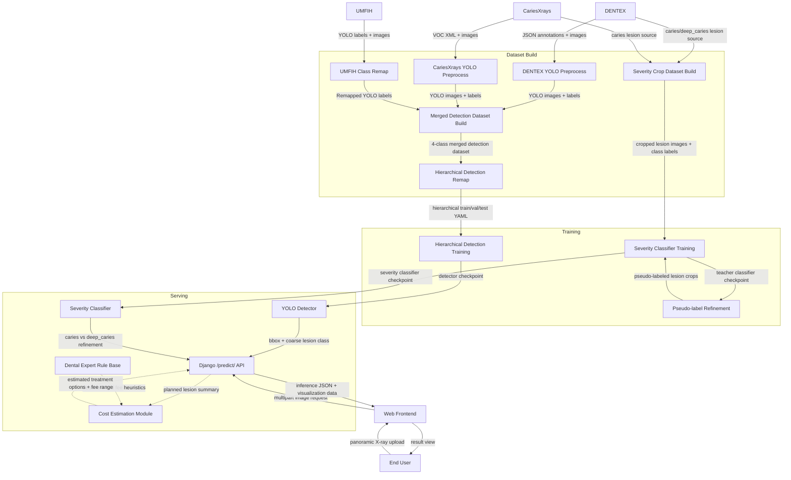

# Dental AI Project Architecture

## 1. 프로젝트 개요

본 프로젝트는 치과 X-ray 이미지에서 병변을 자동 검출하고, 충치 계열 병변은 추가 분류기를 통해 `caries`와
`deep_caries`로 세분화하는 2-stage 진단 보조 시스템을 구축하는 것을 목표로 한다.

이 프로젝트의 문제의식에는 국내 치과 진료 현장에서 제기되는 과잉진료 우려와 진료비 설명 부족 문제가 포함된다.
한국소비자원(2025)은 치과 관련 피해구제 신청에서 진료비 관련 분쟁이 증가하고 있으며, 치료비용계획서 제공
활성화가 필요하다고 지적했다. 또한 파노라마 X-ray 판독은 병변이 작거나 겹쳐 보이는 경우 해석 난도가 높아,
환자 입장에서는 진단의 적절성을 스스로 검증하기 어렵다. 이러한 맥락에서 설명 가능한 보조 판독 도구에 대한
수요가 존재한다.

본 프로젝트는 병변 위치와 유형을 일관된 기준으로 제시함으로써 판독의 재현성을 높이고 설명 가능성을 보완하는
진단 보조 시스템을 지향한다. 궁극적으로는 임상의의 판단을 지원하고, 환자와 의료진 사이의 커뮤니케이션 근거를
강화하는 것이 목적이다. 장기적으로는 X-ray 상의
병변 분류 결과를 바탕으로 치료 옵션별 적정 진료비 범위를 제시하는 보조 모듈까지 확장하는 것을 목표로 하며,
이 과정에서는 치과의사 자문을 반영해 임상적 타당성과 현실성을 확보한다.

현재 기본 학습 흐름은 다음과 같다.

- 1단계 detection: `caries_family`, `periapical_lesion`, `impacted_tooth`
- 2단계 severity classification: `caries` vs `deep_caries`
- 서비스 형태: Django 기반 웹서비스, 프런트엔드 업로드 화면과 `/predict/` API를 함께 제공
- 사용자 흐름: 사용자가 웹 화면에서 파노라마 X-ray 이미지를 업로드하면 백엔드 모델이 추론을 수행
- 향후 확장: 병변 유형별 치료 옵션과 적정 진료비 범위 제시 모듈 추가

프로젝트의 핵심 방향은 다음과 같다.

- 작은 병변과 위치 정보를 함께 다루기 위해 classification보다 detection을 우선 채택
- `deep_caries` 데이터 부족과 coarse label 문제를 줄이기 위해 hierarchical detection 구조 도입
- 로컬 학습, 평가, 서빙이 가능한 local-first 워크플로우 유지

## 2. 프로젝트 구성도

### 2.1 전체 시스템 아키텍처

### 2.2 추론 흐름

```mermaid
graph LR
    user["User"] -->|"image upload"| web["Web Frontend"]
    web -->|"multipart/form-data request"| api["Django /predict/ API"]
    api -->|"decoded X-ray tensor"| det["Hierarchical Detector"]
    det -->|"bbox + confidence + coarse class"| bbox["caries_family / periapical_lesion / impacted_tooth"]
    bbox -->|"caries_family ROI only"| crop["ROI Crop"]
    crop -->|"cropped lesion tensor"| sev["Severity Classifier"]
    sev -->|"caries / deep_caries score"| refine["Severity Refinement"]
    bbox -->|"periapical_lesion / impacted_tooth kept as-is"| merge["Result Merge"]
    refine -->|"refined caries label"| merge
    merge -->|"lesion summary JSON"| out["Response Builder"]
    merge -.->|"planned lesion summary"| cost["Cost Estimation Module"]
    rule["Dental Expert Rule Base"] -.->|"treatment rules + fee table"| cost
    cost -.->|"estimated treatment options + fee range"| out
    out -->|"JSON + overlay metadata"| web
    web -->|"prediction result page"| user
```

### 2.3 현재 기본 학습 흐름

- 기본 학습 흐름: hierarchical detection training
- 기본 detection 데이터 구성: merged detection dataset에서 파생된 hierarchical dataset
- 기본 detection backbone: YOLOv8n
- 기본 epoch: `50`
- 기본 해상도: `imgsz=416`
- 기본 배치 크기: `batch=16`
- 기본 DataLoader workers: `workers=4`
- 기본 early stopping patience: `10`

hierarchical detection 데이터가 준비되지 않은 경우에는 merged detection 데이터에서 coarse class 체계로
자동 재구성한 뒤 학습을 시작한다.

## 3. 사용할 데이터셋

### 3.1 DENTEX

- 용도: 기본 치과 X-ray detection 라벨 소스
- 원본 구조: JSON annotation 기반
- 프로젝트 내 역할:
  - detection supervised training source
  - severity crop supervised source

사용 클래스:

- `caries`
- `deep_caries`
- `periapical_lesion`
- `impacted_tooth`

### 3.2 CariesXrays

- 용도: 충치 계열 bbox 확장 데이터
- 원본 구조: Pascal VOC XML
- 프로젝트 내 역할:
  - detection에서 충치 계열 표본 확장
  - severity pseudo-label 후보 crop source

프로젝트 매핑:

- VOC `Decay` -> project class `caries`

### 3.3 UMFIH Dental Pathology Dataset

- 용도: 추가 병변 데이터 보강
- 원본 구조: YOLO format
- 프로젝트 내 역할:
  - detection 데이터 다양성 확장
  - `periapical_lesion`, `impacted_tooth`, 일부 `caries` 보강

프로젝트 매핑:

- `Carious lesion (4)` -> `caries`
- `Apical periodontitis (7)` -> `periapical_lesion`
- `Impacted tooth (6)` -> `impacted_tooth`

### 3.4 현재 기본 학습 데이터셋

현재 기본 detection 학습은 merged detection 데이터에서 파생된 hierarchical 데이터셋을 사용한다.

- 원본 merged dataset classes:
  - `caries`
  - `deep_caries`
  - `periapical_lesion`
  - `impacted_tooth`
- hierarchical dataset classes:
  - `caries_family`
  - `periapical_lesion`
  - `impacted_tooth`

현재 로컬에 준비된 active split 규모:

- `train`: 5405 images
- `val`: 745 images
- `test`: 1316 images

### 3.5 Severity 분류 데이터셋

충치 계열 refinement를 위해 별도 crop classification 데이터셋을 사용한다.

- 입력: lesion crop
- 출력 클래스:
  - `caries`
  - `deep_caries`

추가로 CariesXrays lesion crop은 unlabeled pool로 저장한 뒤 pseudo-labeling에 사용할 수 있다.

## 4. 데이터 전처리

### 4.1 Detection 전처리

Detection 데이터 전처리 단계는 다음과 같다.

1. DENTEX JSON annotation을 YOLO bbox format으로 변환
2. CariesXrays VOC annotation을 YOLO format으로 변환
3. UMFIH YOLO annotation을 프로젝트 4-class 체계로 remap
4. 여러 detection 데이터셋을 하나의 merged dataset으로 병합
5. 필요 시 train 이미지 oversampling manifest 생성

이 단계의 세부 실행 순서와 사용 명령은 별도 실행 가이드 문서에서 관리한다.

### 4.2 Hierarchical detection 전처리

Hierarchical detection에서는 4-class detection 라벨을 3-class coarse 라벨로 재구성한다.

- `caries` -> `caries_family`
- `deep_caries` -> `caries_family`
- `periapical_lesion` -> `periapical_lesion`
- `impacted_tooth` -> `impacted_tooth`

이 단계의 실제 실행 절차와 명령은 별도 실행 가이드 문서에서 설명한다.

### 4.3 Severity 데이터 전처리

Severity 데이터셋은 DENTEX lesion annotation을 crop으로 잘라 분류 문제로 재구성한다.

- labeled crop 생성
- `train/val/test` CSV 생성
- optional unlabeled crop pool 생성

세부 실행 절차와 데이터 준비 명령은 별도 실행 가이드 문서에서 설명한다.

### 4.4 데이터 분할 전략

현재 프로젝트에서 detection split은 데이터셋별 원본 구조를 최대한 유지하거나, 준비 스크립트에서 분할하여 사용한다.

향후 개선 포인트는 다음과 같다.

- detection 이미지 단위 multi-label stratified split 도입
- 희소 클래스(`deep_caries`, `impacted_tooth`) 분포 안정화
- train/val/test 간 클래스 불균형 완화

## 5. 사용할 모델들 소개

### 5.1 Detection 모델

기본 detection 모델은 Ultralytics YOLOv8n이다.

- 현재 기본 task: hierarchical 3-class detection

선택 이유:

- 경량 모델로 로컬 GPU에서도 실험 가능
- bbox detection 성능과 속도의 균형이 좋음
- Ultralytics 생태계를 이용해 학습, 검증, 체크포인트 관리가 단순함

### 5.2 Severity 분류 모델

충치 세부 단계 분류는 EfficientNet-B0 기반 classifier를 사용한다.

- 기본 모델명: `efficientnet_b0`
- 입력 크기 기본값: `224`
- 출력 클래스:
  - `caries`
  - `deep_caries`

선택 이유:

- lesion crop 분류에 적합한 경량 CNN
- 로컬 GPU에서 학습 가능한 크기
- pseudo-label 재학습 루프와 결합하기 쉬움

### 5.3 서빙 구조

Django inference 단계에서는 detection 결과를 그대로 반환하지 않고, 조건부 refinement를 수행한다.

- 프런트엔드는 사용자가 파노라마 X-ray 이미지를 업로드하는 웹 화면을 제공한다.
- 백엔드는 업로드된 이미지를 `/predict/` API로 전달받아 전처리, detection, refinement, 응답 조립을 수행한다.
- 최종 응답은 bbox, 클래스, confidence, 세부 분류 결과, 향후에는 진료비 추정 정보를 포함하는 JSON 형태를 지향한다.
- `caries_family`가 검출되면 crop classifier로 세분화
- flat detector를 쓸 경우에도 `caries` / `deep_caries`를 후처리 refinement 가능

## 6. 성능평가 방안

### 6.1 Detection 평가 지표

Detection 모델은 다음 지표로 평가한다.

- `precision`
- `recall`
- `mAP50`
- `mAP50-95`

이 중 핵심 기준 지표는 `mAP50-95`다.

이유:

- IoU 0.50부터 0.95까지 여러 임계값에서 평균을 내므로 더 엄격함
- 단순히 객체를 찾는 것뿐 아니라 bbox 위치 정확도까지 반영함
- detection 모델 간 상대 비교에 가장 적합함

### 6.2 Early Stopping 기준

Detection 학습의 early stopping은 Ultralytics validator가 계산하는 fitness를 기준으로 동작한다.

- current detection fitness 기준: `metrics/mAP50-95(B)`
- 기본 patience: `10`

즉, 검증 `mAP50-95(B)`가 일정 epoch 동안 개선되지 않으면 학습을 중단한다.

### 6.3 Severity classifier 평가 지표

Severity 분류기는 다음 지표를 사용한다.

- `val_loss`
- `accuracy`
- `macro F1`

현재 기본 설정:

- best checkpoint 선택 기준: `val_loss`
- early stopping 기준: `val_loss`

### 6.4 실험 비교 방안

모델 비교는 다음 원칙으로 수행한다.

- 같은 데이터셋에서 비교
- 같은 `imgsz`에서 비교
- 가능한 경우 같은 batch / epoch / augmentation 조건 유지
- detection은 `best.pt` 기준으로 동일한 val/test 셋에서 재평가

주요 비교 축:

- flat 4-class vs hierarchical 3-class detection
- `imgsz=416` vs `imgsz=512`
- class balancing on/off
- pseudo-label severity classifier 사용 여부

### 6.5 기록 및 모니터링

Detection 학습은 TensorBoard와 `results.csv`를 통해 모니터링한다.

주요 기록 항목:

- `train/box_loss`
- `train/cls_loss`
- `train/dfl_loss`
- `metrics/mAP50(B)`
- `metrics/mAP50-95(B)`
- `metrics/precision(B)`
- `metrics/recall(B)`
- `val/*`

## 7. 개발 일정

현재 기준 시점은 2026년 4월 2주차이며, 개발 완료 목표 시점은 2026년 6월 2주차로 설정한다. 아래 일정은
향후 간트차트로 전환하기 쉽도록 주차 단위의 마일스톤 중심으로 정리한다.

### 7.1 4월 2주차-4월 3주차: 데이터 정비

- DENTEX, CariesXrays, UMFIH 원본 데이터와 메타정보 재확인
- detection dataset, hierarchical dataset 재생성 및 경로 검증
- split 전략 점검 및 stratified split 적용 여부 검토

### 7.2 4월 4주차-5월 1주차: Detection baseline 확정

- hierarchical detection 기본 학습 파이프라인 안정화
- `imgsz`, `batch`, `workers`, `amp` 조합 실험
- early stopping 기준과 best checkpoint 선정 방식 점검

### 7.3 5월 2주차-5월 3주차: Severity classifier 고도화

- labeled crop 기반 baseline classifier 학습
- class imbalance 보정 및 selection metric 조정
- best severity checkpoint 선정

### 7.4 5월 4주차: Pseudo-label 실험

- unlabeled crop에 teacher inference 수행
- high-confidence pseudo-label 추가
- pseudo-label 포함 재학습 전후 성능 비교

### 7.5 6월 1주차: 서빙 통합 및 API 안정화

- detection + severity refinement API 통합
- 환경변수 기반 가중치 교체 흐름 정리
- 에러 핸들링 및 응답 포맷 안정화

### 7.6 6월 2주차: 문서화 및 개발 완료

- 실험 결과표 및 모델 비교표 정리
- 배포/운영 문서 보강
- 최종 발표용 자료 및 간트차트 정리

## 8. 활용 방안

본 프로젝트의 활용 가능 시나리오는 다음과 같다.

- 치과 X-ray 1차 판독 보조
- 충치 의심 병변의 위치 제안 및 세부 단계 보조 분류
- 병변 유형 기반 치료 옵션 정리 및 적정 진료비 범위 제시
- 교육용 annotation 보조 도구
- 연구용 baseline 및 실험 플랫폼
- 향후 진단 리포트 자동화와 상담 지원 시스템의 전단계 모듈

추가 확장 가능성:

- 치과의사 자문 기반 진료비 계산 모듈 구축
- 환자 단위 리포트 생성
- active learning 기반 재라벨링 루프
- 다기관 데이터 추가 학습
- 웹 대시보드와 진료 워크플로우 통합

## 9. 참고문헌 (Reference)

### 9.1 데이터셋 및 데이터 소스

- Chen, B., Fu, S., Liu, Y., Pan, J., Lu, G., & Zhang, Z. (2024). *CariesXrays: Enhancing caries detection in hospital-scale panoramic dental X-rays via feature pyramid contrastive learning*. Proceedings of the AAAI Conference on Artificial Intelligence, 38(20), 21940-21948. https://doi.org/10.1609/aaai.v38i20.30196
- Chen, B. (n.d.). *AAAI2024_CariesXrays* [Data set and code repository]. GitHub. https://github.com/Binz-Chen/AAAI2024_CariesXrays
- Hamamci, I. E., Er, S., Simsar, E., Yuksel, A. E., Gultekin, S., Ozdemir, S. D., Yang, K., Li, H. B., Pati, S., Stadlinger, B., Mehl, A., Gundogar, M., & Menze, B. (2023). *DENTEX: An abnormal tooth detection with dental enumeration and diagnosis benchmark for panoramic X-rays*. arXiv. https://arxiv.org/abs/2305.19112
- LUNA0206. (n.d.). *DENTEX* [Data set]. Hugging Face. https://huggingface.co/datasets/LUNA0206/DENTEX
- Mureșanu, S., Hedeșiu, M., & Iacob, L.-M. (2025). *Dataset for automating dental condition detection on panoramic radiographs* [Data set]. Zenodo. https://doi.org/10.5281/zenodo.15487430

### 9.2 모델 및 프레임워크

- Django Software Foundation. (n.d.). *Django documentation (Version 4.2)*. https://docs.djangoproject.com/en/4.2/contents/
- Encode OSS Ltd. (n.d.). *Django REST framework*. https://www.django-rest-framework.org/
- PyTorch Contributors. (n.d.). *PyTorch documentation*. https://docs.pytorch.org/docs/stable/index.html
- Tan, M., & Le, Q. (2019). *EfficientNet: Rethinking model scaling for convolutional neural networks*. Proceedings of the 36th International Conference on Machine Learning, 97, 6105-6114. https://proceedings.mlr.press/v97/tan19a.html
- Ultralytics. (n.d.). *Ultralytics YOLO docs*. https://docs.ultralytics.com/

### 9.3 배경 자료

- Korea Consumer Agency. (2025, December 5). *Dental treatment cost disputes are rapidly increasing; provision of treatment cost plans needs to be activated*. https://www.kca.go.kr/home/sub.do?menukey=4005&mode=view&no=1003974692
